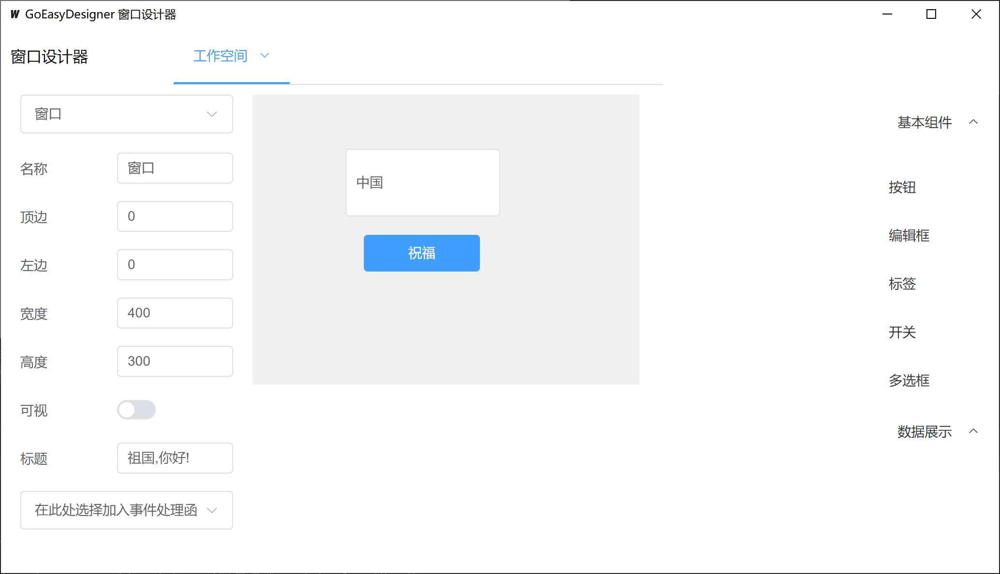

# GoEasyDesigner 窗口设计师




基于 go 语言 使用 wails框架 支持 Window Macos Linux 等系统.

主仓库 https://github.com/duolabmeng6/GoEasyDesigner 

镜像仓库 https://gitee.com/duolabmeng666/go-easy-designer 

**项目进度：**

项目处于积极开发阶段 欢迎前端大佬pr


已完成任务：
- [x] 跨平台兼容性：在Windows、macOS和Linux上进行了测试，确保软件能够顺利运行。

- [x] 界面设计和功能开发：完成了整体界面布局、功能流程设计、界面绘制、属性修改、组件拖拽、双击组件跳转到对应事件函数等核心功能的开发。

- [x] 智能代码编辑器：实现了代码编辑框的汉字首字母输入提醒功能，提高了编码效率。

- [x] goefun库支持：[goefun库](https://pkg.go.dev/github.com/duolabmeng6/goefun#section-sourcefiles)，允许在Golang中使用中文函数进行开发。

- [x] 布局容器改进：包括常用布局，弹性布局

- [x] 已完成组件库：按钮 编辑框 标签 开关 单选框 多选框 常用布局 弹性布局 树形框 菜单 表格 进度条 选择夹

待完成任务：
- [ ] jsefun库支持：计划中，等待开发中。

- [ ] 组件库完善：正在进行中， [element-plus](https://element-plus.org/zh-CN/component/button.html) 组件的进一步完善。

- [ ] 集成开发环境：计划中，将实现无需繁琐配置，直接开发的环境。

- [ ] 多语言支持：计划中，将支持中文和英文等多种语言。

- [ ] 支持ElectronJS：计划中，将支持ElectronJS作为后端技术。

我们将继续努力，确保项目按计划进行，并提供更多强大的功能和支持。请继续关注我们的进展！

# 在线体验

没钱买服务器所以都是白嫖 pages 国内打不开就换一个地址

https://g.yx24.me

https://gg.yx24.me

https://ggg.yx24.me

https://goeasy.onrender.com

https://go-easy-designer.vercel.app

画好界面点保存,会下载2个文件 `设计文件.json`,`辅助代码.js`

注意你的浏览器允许下载多个文件的权限

下载本项目的代码找到 wails-demo复制出来.

`wails-demo/frontend/src/窗口/设计文件.json`

`wails-demo/frontend/src/窗口/辅助代码.js`

运行项目 就可以看到你设计好的界面了.

```
cd wails-demo
wails dev
```

想要更好的无缝使用体验需要下载客户端程序.

# 快速上手

请按顺序安装好

[视频教程10分钟了入门](https://www.bilibili.com/video/BV1ou4y1r7WS)

[视频教程3分钟学会自定义组件封装](https://www.bilibili.com/video/BV1ar4y1f7Rq)


### 1.安装 go 语言开发环境

[go语言下载页面](https://golang.org/dl/) 版本任意

安装 wails [wails框架文档](https://wails.io/zh-Hans/docs/gettingstarted/installation/)

国内镜像执行 `go env -w GOPROXY=https://goproxy.cn,direct`

```
go install github.com/wailsapp/wails/v2/cmd/wails@latest
```

安装成功后，运行 wails 命令，有内容输出即为安装成功。

### 2.安装 node js语言开发环境

[node语言下载页面](https://nodejs.org/zh-cn/download/) 版本18以上

国内镜像 `npm install -g cnpm --registry=http://registry.npmmirror.com`

安装vite `npm create vite@latest`


### 3.下载本项目

`GoEasyDesigner/wails-demo` 该目录为设计好的界面最终运行的环境你的代码也将在这里编写

wails 同时调试前端和后端

```
cd wails-demo
wails dev
```

仅调试前端

```
cd wails-demo/frontend
npm run dev
```

### 4.下载 GoEasyDesigner

下载最新版本: https://github.com/duolabmeng6/GoEasyDesigner/releases

直接运行即可

设计好的界面数据保存在这里

```
wails-demo/frontend/src/窗口/设计文件.json
```

### 5. webstorm IDE代码跳转插件

想体验双击组件在ide中自动跳转到对应函数 请在webstorm中安装 QtEasyDesigner 插件,在本项目的文件中，

安装后在IDE编辑器中右键看到 `配置 QtEasyDesigner ` 

macos填写路径
```
/Applications/GoEasyDesigner.app/Contents/MacOS/GoEasyDesigner
```

window填写exe的路径
```
C:\GoEasyDesigner\GoEasyDesigner.exe
```

后续使用的话 打开 `设计文件.json` 在编辑器中右键  `打开 QtEasyDesigner ` 界面就出来了

js代码使用 webstorm ide 绝大部分编写代码都应该在 js中编写,如果js无法实现的再调用go代码
go代码使用 goland IDE 编写 一般情况下代码写在 app.go 中

### 开发组件请看

#### 运行 GoEasyDesigner

wails 同时调试前端和后端

```
cd GoEasyDesigner
wails dev
```

如果调试前端可以这样

```
cd GoEasyDesigner\frontend
vite 
```

在ide中调试需要以下配置

构建软件包 `changeme` 

工作目录 `/Users/ll/Documents/GitHub/GoEasyDesigner/GoEasyDesigner` 改成你的路径

环境变量 `CGO_LDFLAGS=-framework UniformTypeIdentifiers` 这个macos需要 window不需要

go工具实参 `-tags dev -gcflags "all=-N -l"`

程序实参(可选) `文件路径=/Users/ll/Documents/GitHub/GoEasyDesigner/wails-demo/frontend/src/窗口/设计文件.json port=8080` 这是配合ide插件的port是插件的端口 

现在可以在 app.go 中下断点调试了.

#### wails-demo 为模板项目

保存界面数据到这里

```
wails-demo/frontend/src/窗口/设计文件.json
```

运行 就可以看到效果了

```
cd wails-demo
wails dev
```


# 贡献

贡献者列表对于自述文件来说太大了！ 所有为这个项目做出贡献的杰出人士在这里 [贡献列表](https://github.com/duolabmeng6/GoEasyDesigner/graphs/contributors)
后面我们会制作页面


# 许可证

本项目采用 [GNU Lesser General Public License (LGPL) 版本 3](LICENSE) 进行许可。详细信息请参阅许可证文件。

# 学习交流

QQ群: 927427009`