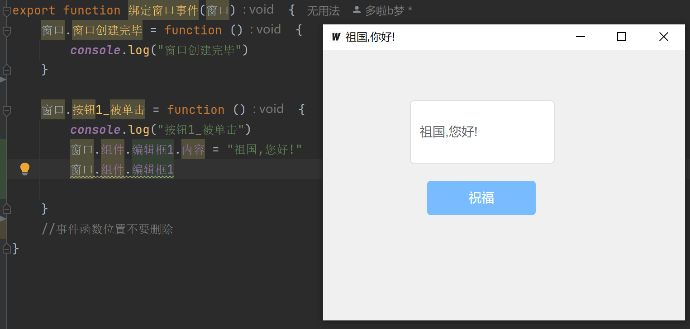

# GoEasyDesigner 窗口设计器

项目处于积极开发阶段

基于 go 语言 使用 wails框架, 支持 window macos linux 等系统.

# 运行 GoEasyDesigner

wails 同时调试前端和后端

```
cd GoEasyDesigner
wails dev
```

如果调试前端可以这样

```
cd GoEasyDesigner\frontend
vite 
```

# wails-demo 为模板项目

保存界面数据到这里即可

```
wails-demo/frontend/src/stores/组件数据.json
```

运行 就可以看到效果了

```
cd wails-demo
wails dev
```

# 附带IDE代码跳转插件
配置的话请安装 QtEasyDesigner 插件
重启ide就可以看到端口号
例如
```
http://127.0.0.1:13403
```
后续我重新开发这个插件..先凑合玩耍吧.


